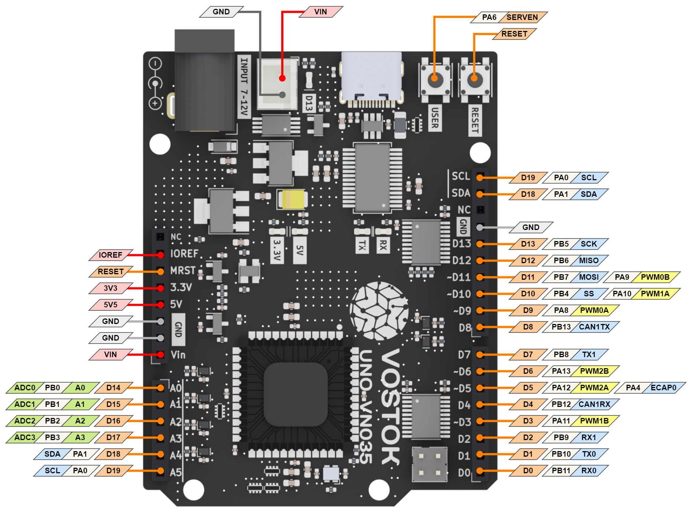

# Vostok k1921vk arduino
[](https://registry.platformio.org/tools/dcvostok/vostok-1-frmwrk-vn-arduino)
[](README.md)
[](README.ru.md)  


Данный репозиторий добавляет поддержку микроконтроллеров [НИИЭТ К1921ВК](https://niiet.ru/product-category/chips/microcont/risc-32-bit/) в Arduino IDE и [PlatformIO](http://platformio.org).

# Документация 
*  Руководство пользователя [VOSTOK_UNO-VN035.pdf](doc/VOSTOK_UNO-VN035.pdf)
*  Электрическая схема [VOSTOK_UNO-VN035_circuit.pdf](doc/VOSTOK_UNO-VN035_circuit.pdf)
*  [Активация отладки через JTAG/SWD разьем](doc/Activate_JTAG.ru.md)
# Начало работы в ArduinoIDE
1. Установите [arduino IDE](https://www.arduino.cc/en/software)
2. Откройте меню `Файл > Настройки`
3. Добавьте данную ссылку в "Дополнительные ссылки для Менеджера плат" field:
```
https://raw.githubusercontent.com/DCVostok/vostok-arduinoide-board-manager/main/package_vostok_index.json
```
1. Откройте меню `Инструменты > Плата > Менеджер плат...`
2. Выберите тип: `Внесены`
3. Кликните на `Установка` в `k1921vk MCU based boards`
# Начало работы в  VS Code+PlatformIO
1. [Установите VS Code](https://code.visualstudio.com/)  
2. [Установите VS Code+PlatformIO](https://docs.platformio.org/en/latest/integration/ide/vscode.html#ide-vscode)
## GUI

1. Откройте Platform IO меню в VS Code
2. Кликните на "New Project"
    * Name - <Название проекта>
    * Board - Vostok UNO-VN035
    * Framework - Arduino
3. Platform IO автоматически загрузит все требуемые компоненты.
4. Добавьте строчку `upload_port = COM5` в [platformio.ini](http://docs.platformio.org/page/projectconf.html), чтобы выбрать порт для загрузки прошивки
## Вручную

1. Создайте проект PlatformIO и настройте файл [platformio.ini](http://docs.platformio.org/page/projectconf.html) согласно примеру ниже:  
Примечание: Вы можете использовать пример проекта [Blink](examples/Platformio/Blink)

1. Дождитесь пока PlatformIO подготовит проект, Platform IO автоматически скачает все необходимые компоненты.

2. Нажмите на кнопку **PlatfromIO:Build**.  
Примечание 1: Русские или другие символы юникода в пути до проекта или ядра platform io могут вызвать проблемы со сборкой проекта.  

## Пример файла platformio.ini 
```ini
[env:Vostok_uno]
platform = k1921vk
board = vostok_uno_vn035
framework = arduino
upload_port = COM11
monitor_port = COM11
monitor_speed = 115200
...
```

## Пример platformio.ini с последней версией платформы с github
Примечание: В ОС Windows должен быть установлен `git`.
```ini
[env:Vostok_uno]
platform = k1921vk
board = vostok_uno_vn035
framework = arduino
upload_port = COM11
monitor_port = COM11
monitor_speed = 115200
platform_packages = vostok-1-frmwrk-vn-arduino @ https://github.com/DCVostok/vostok-1-frmwrk-vn-arduino#main
...
```

# Дополнительные функции в arduino core
## analogReadResolution
Настраивает разрядность АЦП и функции `analogRead`.  
По умолчанию используется разрядность 10 бит (0-1023). Максимально возможная разрядность - 12 бит (0 - 4095).  
`res` - 

```
void analogReadResolution(int res)
```

## analogWriteResolution
Настраивает разрядность ШИМ и функции `analogWrite`.  
По умолчанию используется разрядность 8 бит (0-255). Максимально возможная разрядность - 10 бит (0 - 1023). 
`res` - разрядность в битах.

```
void analogWriteResolution(int res)
```

## analogWriteFrequency
Настраивает  частоту PWM для функции `analogWrite`.  
По умолчанию установлена частота E_ANALOG_WRITE_FREQ_1K_Hz (1000 Гц).  
`freq` - Частота из перечисления enum eAnalogWriteFreq

```
typedef enum { // CLKDIV|HSPCLKDIV
  E_ANALOG_WRITE_FREQ_54_Hz  , // real freq 54 Hz
  E_ANALOG_WRITE_FREQ_508_Hz , // real freq 508 Hz
  E_ANALOG_WRITE_FREQ_1K_Hz  , // real freq 1017 Hz
  E_ANALOG_WRITE_FREQ_97K_Hz , // real freq 97656 Hz
  E_ANALOG_WRITE_FREQ_49K_Hz , // real freq 48828 Hz
  E_ANALOG_WRITE_FREQ_24K_Hz , // real freq 24414 Hz
  E_ANALOG_WRITE_FREQ_12K_Hz , // real freq 12207 Hz
  E_ANALOG_WRITE_FREQ_6K_Hz  , // real freq 6103 Hz
  E_ANALOG_WRITE_FREQ_3K_Hz  , // real freq 3051 Hz
  E_ANALOG_WRITE_FREQ_10K_Hz , // real freq 9765 Hz
  E_ANALOG_WRITE_FREQ_8K_Hz  , // real freq 8138 Hz
  E_ANALOG_WRITE_FREQ_7K_Hz  , // real freq 6975 Hz
} eAnalogWriteFreq;
```

```
void analogWriteFrequency(eAnalogWriteFreq freq)
```

# Протестированные библиотеки arduino

|Library|Description|Result|Notes|
|---------|---------|------|-----|
|Servo|Встроенная библиотека arduino `Servo`|+|Any digital pin can be used. Max 16 servos|
|SPI|Встроенная библиотека arduino `SPI`|+|  |
|TimerOne|Встроенная библиотека arduino для настройки прерывания по таймеру|+|Используется TMR1. См. [TimerOne readme.md](libraries/TimerOne/readme.md)|
|TimerZero|Встроенная библиотека arduino для настройки прерывания по таймеру|+|Используется TMR0. См. [TimerZero readme.md](libraries/TimerZero/readme.md)|
|Wire|Встроенная библиотека arduino `I2c`|+||
|[NewPing](https://bitbucket.org/teckel12/arduino-new-ping/src/master/)|Билиотека для ультразвукового дальномера|v1.9.4|[See example](examples/Platformio/NewPing)|
|[SD Library](https://www.arduino.cc/en/Reference/SD)|Библиотека позволяющая считывать и записывать информацию на карты `SD`|v1.2.4|[Пример](examples/Platformio/SD_card)|
|[MPU6050](https://github.com/electroniccats/mpu6050)|MPU-6050 6-осевой акселерометр/гироскоп.|v0.5.0|  |
|[Adafruit_ADXL343](https://github.com/adafruit/Adafruit_ADXL343)|Драйвер [Adafruit ADXL343 Breakout](http://www.adafruit.com/products/). Основан на [Adafruit's Unified Sensor Library](https://github.com/adafruit/Adafruit_Sensor).|v1.6.2|  |
|[BME280](https://github.com/finitespace/BME280)|Билиотека Arduino для чтения информации с датчика Bosch BME280 через протоколы `I2C`, `SPI` or `Sw SPI`.|v3.0.0|  |
|[LCD_I2C](https://github.com/blackhack/LCD_I2C)|Библиотека Arduino для LCD HD44780 и его клонов.Работает в 4 битном режиме через I²C интерфейс с 8-битным PCF8574/PCF8574A расширителем GPIO портов.|v2.3.0|  |


# Распиновка Vostok UNO-VN035

